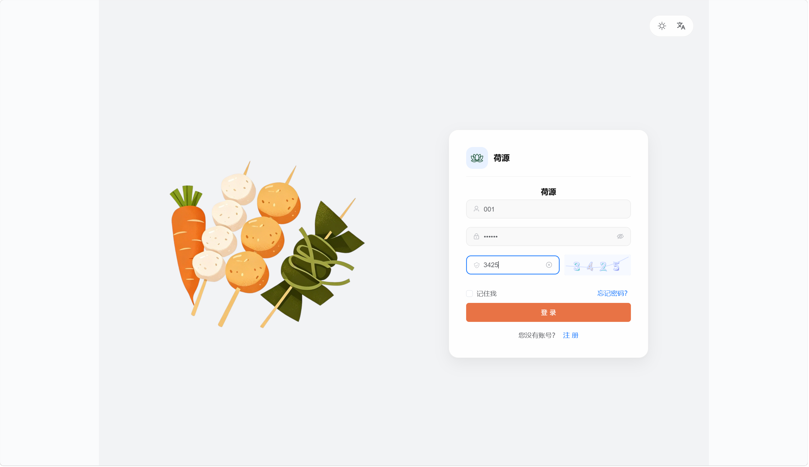
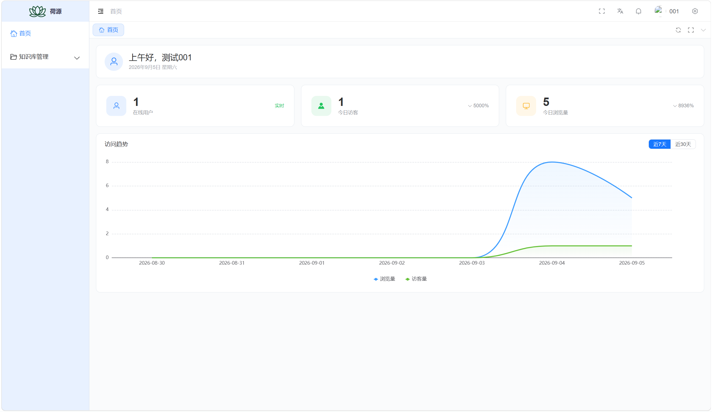
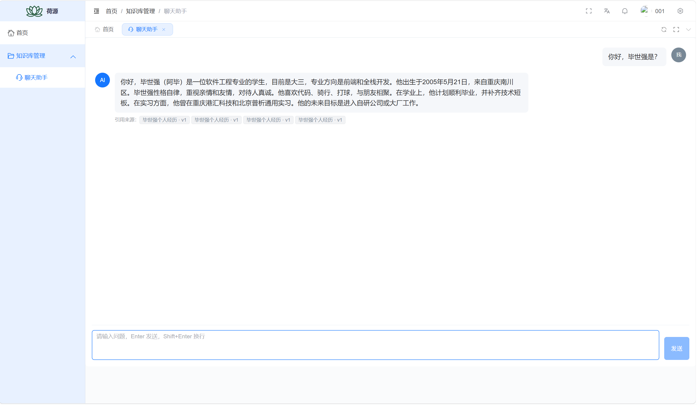

<div align="center">


# 荷源后台管理

**Vue3 + Vite + TypeScript 企业级后台管理前端**

[](https://vuejs.org/)
[](https://element-plus.org/)
[](https://github.com/BI-shi-qiang/HY-admin)
[](LICENSE)

</div>

<div align="center">
  <a target="_blank" href="https://admin.heyuan.ink">🖥️ 在线预览</a> | <a target="_blank" href="https://heyuan.ink">🌐 官网</a> | <a target="_blank" href="https://github.com/BI-shi-qiang/HY-admin">💻 源码仓库</a>
</div>

## 项目简介

荷源后台管理（heyuan-admin）基于 Vue3、Vite、TypeScript 和 Element-Plus 搭建的开箱即用企业级后台管理前端，配套 Java 后端提供完整的前后端分离开发方案。

## 项目特色

- **简洁易用**：基于 [vue-element-admin](https://github.com/PanJiaChen/vue-element-admin) 升级的 Vue3 版本，无过渡封装，易上手。
- **系统功能**：提供用户管理、角色管理、菜单管理、部门管理、字典管理、系统配置、通知公告等功能模块。
- **权限管理**：支持动态路由、按钮权限、角色权限和数据权限等多种权限管理方式。
- **多租户**：支持多租户模式与租户隔离。
- **基础设施**：提供国际化、多布局、暗黑模式、全屏、水印、接口文档和代码生成器等功能。

## 系统预览

**PC 端**

<table align="center">
  <tr>
    <td></td>
    <td></td>
  </tr>
  <tr>
    <td></td>
    <td></td>
  </tr>
  <tr>
    <td></td>
    <td></td>
  </tr>
</table>

**移动端**

<table align="center">
  <tr>
    <td></td>
    <td></td>
    <td></td>
    <td></td>
  </tr>
</table>

## 环境准备

| 环境类型     | 版本要求                                                     | 备注                              |
| ------------ | ------------------------------------------------------------ | --------------------------------- |
| **Node.js**  | `^20.19.0` 或 `>=22.12.0`                                    | 推荐使用 LTS 版本（主版本为偶数） |
| **包管理器** | `pnpm >= 8.0.0`                                              | 项目使用 pnpm 作为包管理器        |
| **开发工具** | [Visual Studio Code](https://code.visualstudio.com/Download) | 推荐安装 Vue、TypeScript 相关插件 |

## 快速开始

```bash
# 克隆代码
git clone https://github.com/BI-shi-qiang/HY-admin.git

# 切换目录
cd HY-admin

# 安装 pnpm
npm install pnpm -g

# 设置镜像源(可忽略)
pnpm config set registry https://registry.npmmirror.com

# 安装依赖
pnpm install

# 启动运行
pnpm run dev
```

## 项目部署

执行 `pnpm run build` 命令后，项目将被打包并生成 `dist` 目录。接下来，将 `dist` 目录下的文件上传到服务器 `/usr/share/nginx/html` 目录下，并配置 Nginx 进行反向代理。

```bash
pnpm run build
```

以下是 Nginx 的配置示例：

```nginx
server {
    listen      80;
    server_name localhost;

    location / {
        root   /usr/share/nginx/html;
        index  index.html index.htm;
    }

    # 反向代理配置
    location /prod-api/ {
        # 请将 api.heyuan.ink 替换为您的后端 API 地址，并注意保留后面的斜杠 /
        proxy_pass http://api.heyuan.ink/;
    }
}
```

## 本地Mock

项目同时支持在线和本地 Mock 接口，默认使用线上接口，如需替换为 Mock 接口，修改文件 `.env.development` 的 `VITE_MOCK_DEV_SERVER` 为 `true` **即可**。

## 注意事项

- **自动导入插件自动生成默认关闭**

  模板项目的组件类型声明已自动生成。如果添加和使用新的组件，请按照图示方法开启自动生成。在自动生成完成后，记得将其设置为 `false`，避免重复执行引发冲突。

- **项目启动浏览器访问空白**

  请升级浏览器尝试，低版本浏览器内核可能不支持某些新的 JavaScript 语法，比如可选链操作符 `?.`。

- **项目同步仓库更新升级**

  项目同步仓库更新升级之后，建议 `pnpm install` 安装更新依赖之后启动 。

- **项目组件、函数和引用爆红**

  重启 VSCode 尝试

- **其他问题**

  如果有其他问题或者建议，欢迎提交 [Issue](https://github.com/BI-shi-qiang/HY-admin/issues)

## 提交规范

执行 `pnpm run commit` 唤起 git commit 交互，根据提示完成信息的输入和选择。
